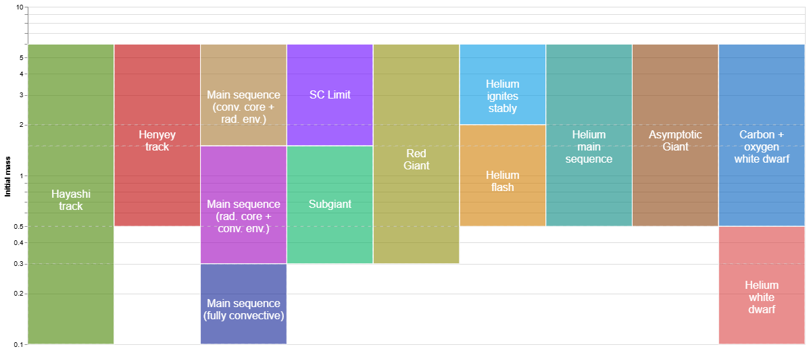
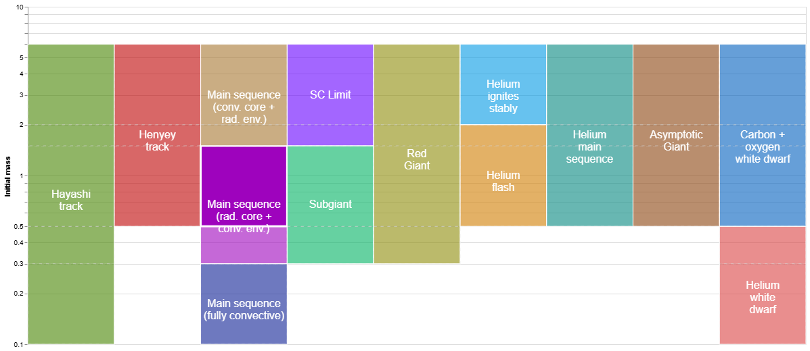
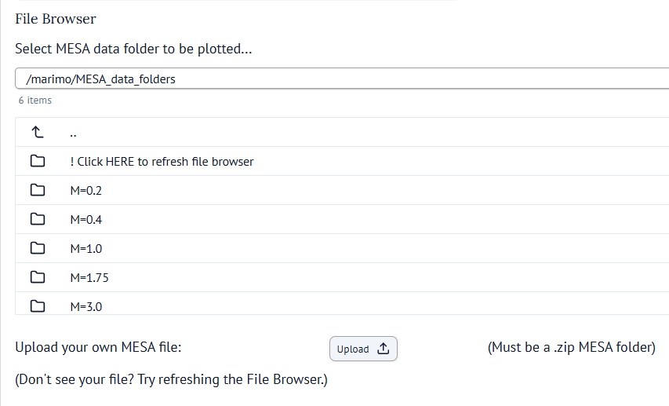
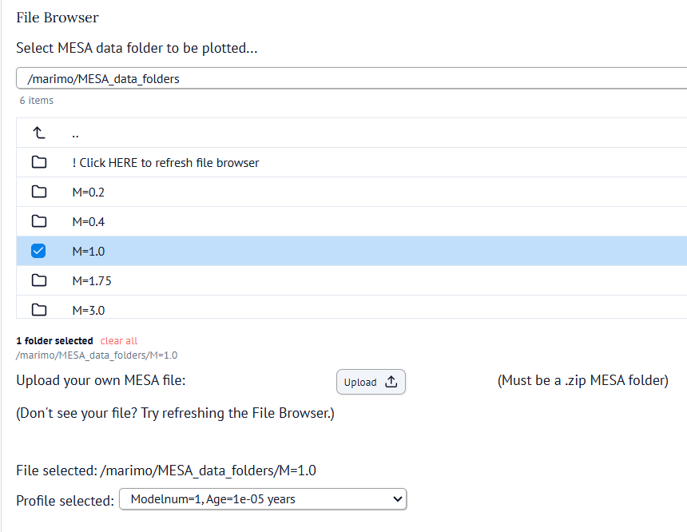
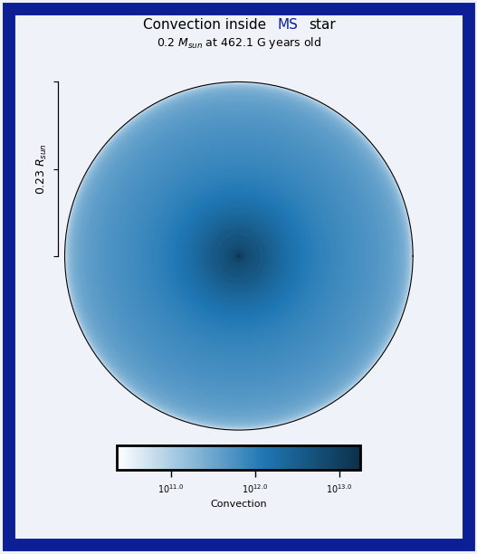
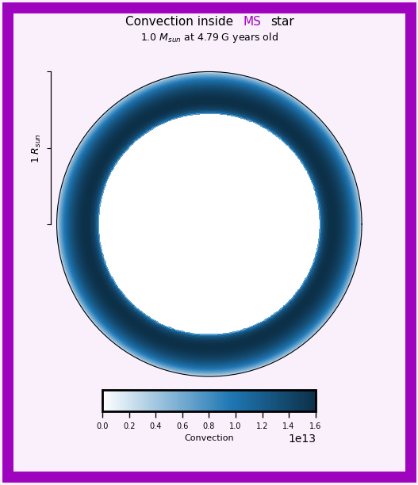
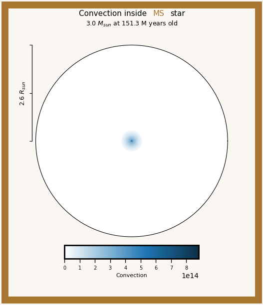
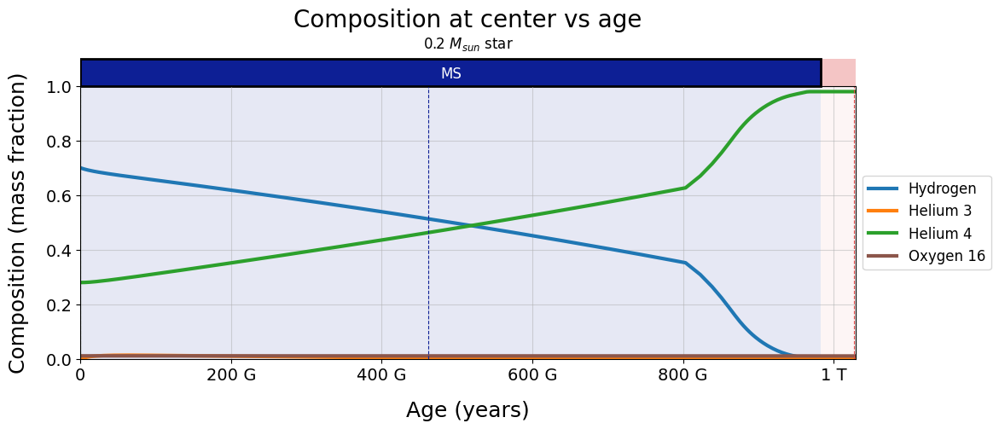
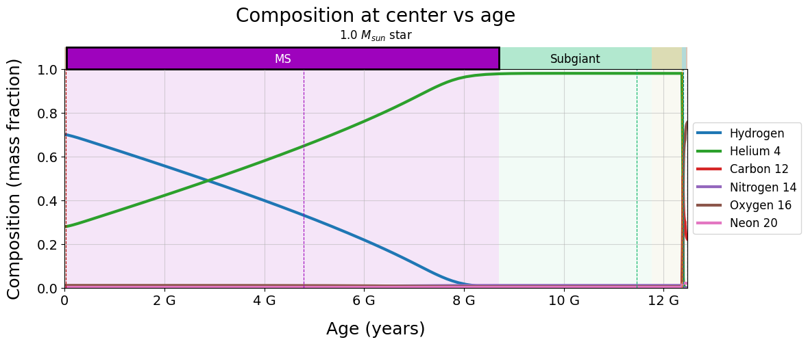
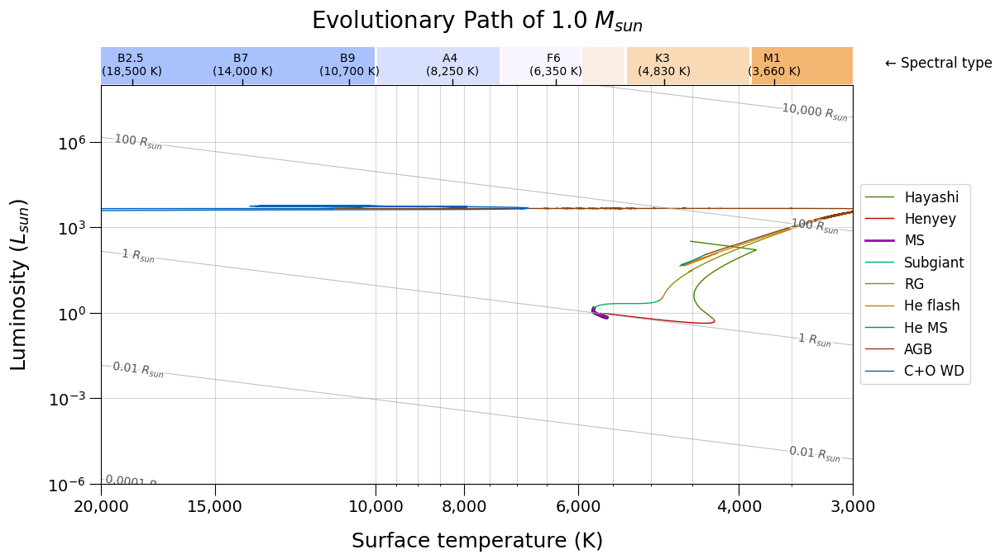

# Interactive Stellar Evolution Visualizer 

> ⚠️ **Note:** This project is under active development. Some features may be incomplete and some known issues remain. See the **Issues** page for current limitations and known issues. 
> 
> If you have any comments/suggestions or would like to report a bug, please reach out to me via email (john-momberg@uiowa.edu) or go ahead and add an issue to this repository's **Issues** tab. 
> 
> Your feedback is greatly appreciated. Thank you! -John 

---

## Table of Contents 
- [Get Started: How to access the tool in your browser](#get-started)
- [Overview: What is this tool?](#overview)
- [User Guide](#user-guide)
- [Examples](#examples)
- [Acknowledgements](#acknowledgements)
- [License](#license)

---

<h2 id="get-started">Get Started: How to access the tool in your browser</h2>

Click here to load the tool in your browser: https://marimo.app/github.com/johnmomberg/Interactive_Stellar_Evolution_Visualizer/blob/main/main.py 
- To hide the source code, click the button with **three boxes** in the bottom-right corner of the screen.

--- 

<h2 id="overview">Overview: What is this tool?</h2>

This project is an interactive tool for visualizing stellar evolution. It uses models generated with MESA to represent different types of stars, and allows users to compare properties between masses (low mass vs high mass) as well as over time/evolutionary stage (pre-MS vs main sequence vs red giant, etc). It’s designed to be a supplemental resource for students and instructors in a course on stellar evolution. The goal is to provide users a way to visualize key properties of stars. If you're interested in using this resource in your own classroom, please reach out to me via email! I would love to hear your feedback. 

--- 

<h2 id="user-guide">User Guide</h2>
 

### Controls 
To use the tool, first make a selection using the Controls section. Depending on the options you select, the corresponding plot will be generated and displayed in the Plot section below. 

  - ### 1. Choose variable to plot 
    Select the type of plot you want to generate:
      - **HR diagram**: Shows the star’s path across the HR diagram. 
      - **History**: a variable vs. time (e.g., radius vs. time). 
      - **Interior profile**: interior structure (variable vs. location inside the star) at one snapshot in time.
    
    For **Interior profile**, you can additionally select the units used on the x-axis: 
      - **Radius**: Distance from the center (default selection) 
      - **Mass coordinate**: The amount of mass interior to each point. (For example, 'x = 1.5' means the location in the star where a sphere extending to your current radius would contain a total of 1.5 solar masses). 

---

    
  - ### 2. Choose type of star 
    There are two ways to choose the type of star to visualize:

      - ### Option 1: Select evolutionary stage and mass range 

        This mode allows you to explore stellar evolution using a pre-curated set of representative examples. I have assigned MESA models to different mass ranges (low, intermediate, and high mass stars) and evolutionary stages (main sequence, red giant, helium burning, white dwarf, etc.) in order to provide an overview of how stars of different masses evolve over time. 
        
        When this mode is selected, an interactive stellar evolution flowchart will appear: 

        

        The goal of this diagram is to give an overview of stellar evolution as a whole.  
          - Y-axis: **Initial mass**. For a given value of mass, you can move horizontally to see how stars of that mass evolve. 
          - X-axis: **Evolutionary stage**. This axis can be thought of as corresponding to age, but note that it is not actually linear in time, since stars spend different amounts of time in each stage, and their lifetimes depend heavily on their mass. 

        Each box represents a range of masses that exhibit similar behavior during a particular point in their lives. Moving vertically between two boxes allows users to see the boundary between two distinct types of evolution and compare how stars of different masses evolve. 
        
        Blank space represents a range of masses that does not experience a certain stage at all. (For example, stars smaller than 0.5 solar masses never get hot enough to fuse helium, so they skip directly from the Red Giant phase to the White Dwarf phase.) As you move horizontally, if you encounter a blank region, you can skip immediatly through the blank region until you reach the next box. 
        
        The right side of the flowchart shows the corresponding **spectral type** for each mass. Note that this spectral type denotes the spectral type that star has *when it's on the main sequence*, not its spectral type at any other point in its life (since spectral type can change over time). The goal of these labels is to provide a conversion between describing stars as their spectral type to what mass that correlates to. For instance, if you're reading a paper that talks about the evolution of B3 stars, you might wonder where in this flowchart do those types of stars occur? This spectral type axis provides a way to make that conversion. 
        
        To select a star, simply click on one of the boxes in the flowchart. Once selected, the box will appear highlighted:
        
        
        
        Each box in the flowchart is associated with a representative MESA model that is automatically loaded and visualized when that box is selected. These models are intended to serve as characteristic examples of stars within a particular mass range and evolutionary stage.
        
        For example, in the image above, the Main Sequence stage for stars in the 0.5–1.5 solar mass range has been selected. In this case, a MESA model with a mass of 1.0 solar masses and an age of 4.79 Gyr has been chosen to represent the typical properties of stars in this category.
        
        This mode is intended primarily as an educational tool for exploring and comparing the major pathways of stellar evolution. See the [Examples](#examples) section below for examples of how this could be used as an educational resource. 

--- 

  - ### Option 2: Select MESA file directly

    This tool also functions as a general MESA file explorer. Rather than selecting from the curated evolutionary categories in the flowchart, this mode allows you to directly choose a MESA file to visualize.

    This mode is useful for users who:
      - want to explore stellar evolution beyond the curated examples,
      - want to examine intermediate evolutionary states,
      - or want to analyze their own MESA simulations.

    When this mode is selected, a file browser will appear.
    

    
    

    To select a MESA folder, click the icon **next to** the folder name. Do not click directly on the folder name itself, since clicking the folder name enters the folder instead of selecting it. After selecting a folder, the file browser will look like this: 

    

    
    

    Once a MESA folder has been selected, you can choose a specific point in the star’s evolution using its model number (`modelnum`). Model numbers identify which MESA profile file should be loaded. These model numbers are not evenly spaced in time. MESA automatically outputs more models during periods of rapid stellar evolution and fewer models during long periods where the star changes slowly. To select a profile, use the profile dropdown selector located below the file browser. 

    - ### Upload Your Own MESA Folder

      You can also upload your own MESA file in order to use these visualization tools with your own data.

      A valid MESA file looks like a `.zip` compressed folder which contains the following files: 
        - a `history.data` or `trimmed_history.data` file,
        - and a collection of profile files such as `profile1.data`, `profile2.data`, etc.

      To upload your own run:
        1. Compress the MESA folder into a `.zip` file.
        2. Click the Upload button and select your `.zip` file.

      After uploading, the folder may not immediately appear in the file browser. If this happens, refresh the browser using the following steps:
        1. Enter the special folder labeled “Click HERE to refresh file browser”.
        2. Use the back arrow to return to the parent directory.

      Entering and leaving a subfolder forces the file browser to refresh, and your uploaded MESA run should now appear.

      If you are unfamiliar with MESA but would like to experiment with your own stellar evolution models, you can generate simple MESA runs directly in your web browser using the following tool: 

      http://user.astro.wisc.edu/~townsend/static.php?ref=mesa-web-submit 

--- 

### Plot 

After making your selections in the Controls section, the requested plot will be generated and displayed in the Plot section. See the [Examples](#examples) section below for examples of plots generated using this tool. 

--- 

<h2 id="examples">Examples</h2>

This section demonstrates a few ways this tool could be used in both educational and research contexts. These examples are intended to show how the combination of interactive plots and the stellar evolution flowchart can help users better understand and explore stellar evolution. 

---

- ## Example 1: Comparing Heat Transport Methods in Different Stars

  Suppose you are teaching a lecture on energy transport inside stars, and want a way to visualize the convection and radiative transport regions in stars of different masses. Using the flowchart, you could select stars from different mass ranges and generate interior structure plots showing where convection occurs inside each star.

  

    
    
    
  

  The background shading in all three plots corresponds to the currently selected region in the flowchart, indicating the associated mass range being visualized.

  Using these plots, we can see that:
  - Very low mass stars are fully convective.
  - Solar-type stars have radiative interiors and convective envelopes.
  - High mass stars instead have convective cores and radiative envelopes.
  
  Because the flowchart organizes stars by both mass and evolutionary stage, it's also to see where the transition between these behaviors occurs. By moving vertically through the Main Sequence boxes, students can directly compare how the internal structure changes as stellar mass increases.
  
---

- ## Example 2: Comparing Stellar Lifetimes and Core Composition Evolution

  How long do stars spend on the main sequence, and how does their composition change over time? This tool could be used to answer questions like these by plotting the central composition as a function of time. 
  
  For instance, you could compare:
  - a very low mass star that never ignites helium,
  - and a somewhat larger star that eventually undergoes helium fusion.
    
  
  

  These plots allow students to directly visualize:
  - hydrogen gradually being converted into helium during the main sequence,
  - the onset of helium burning,
  - and the eventual formation of different types of white dwarfs (helium vs carbon+oxygen, depending on if its massive enough to ignite helium). 
  
  They also reveal the enormous differences in stellar lifetimes: For example, a 0.2 solar mass star may require over a trillion years to fully evolve, while higher mass stars evolve dramatically faster. Seeing these timescales plotted directly helps communicate just how strongly stellar evolution depends on mass.
  
---

- ## Example 3: Following Stellar Evolution Across the HR Diagram

  The HR diagram is one of the most important tools in stellar astrophysics, but students are often first introduced to it using simplified schematic diagrams. This tool instead allows users to follow the evolution of actual MESA stellar evolution models across the HR diagram.
  
  

  These plots allow users to: 
  - follow pre-main sequence evolution along the Hayashi and Henyey tracks,
  - observe the expansion into the Red Giant branch,
  - and compare how stars of different masses move through the HR diagram over time.
  
  Because these tracks come directly from stellar evolution models rather than hand-drawn approximations, students can compare the simplified pictures commonly shown in class to real data from stellar models. Seeing that what they learned in class really does (approximately, at least) happen in the models, and confirming that the simplified picture they learned is justified, is always exciting. 

--- 

<h2 id="acknowledgements">Acknowledgements</h2>

This project was funded by the OpenHawks Open Educational Resources (OER) Grant, provided by the University of Iowa Office of the Provost and the UI Libraries. 

This project would not be possible without the MESA (Modules for Experiments in Stellar Astrophysics) stellar evolution modeling software. For more information about MESA, see here: https://mesastar.org/ 

This project would also not be possible without Marimo, a python package that provides the interactivity for this project. For more information about Marimo, see here: https://marimo.io/ 

I would like to thank Ken Gayley, my PhD advisor, for support and guidance throughout this project. 

Finally, I want to thank everyone who has helped me test this project and gave me feedback, including but not limited to: Andi Swirbul, Nathan Helvy, Scott Call, Chris Piker, Philip Griffin, Jerry Wang, Kaili Cao, Paul from the Marimo discord (whose GitHub account is here: https://github.com/eckp), and more. Your feedback, comments and testing have been invaluable to this project. 

--- 

<h2 id="license">License</h2>

This open-access tool is covered by the CC BY-NC 4.0 license. This license enables reusers to distribute, remix, adapt, and build upon the material in any medium or format for noncommercial purposes only, and only so long as attribution is given to the creator. For more information, see here: https://creativecommons.org/licenses/by-nc/4.0/ 

